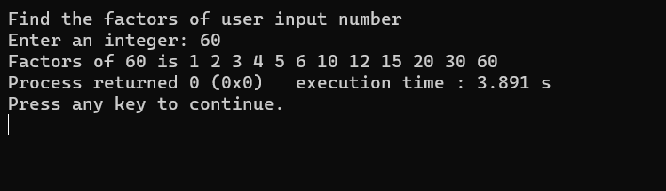

# Finding Factors of Number



## Introduction

Welcome to the "Finding Factors of Number" project! This repository hosts a versatile C++ program that quickly calculates and displays all the factors of a specified number. Explore the divisors and properties of numbers effortlessly.

## Features

- **Factor Calculation**: Swiftly computes the factors of any input number.
- **User-Friendly**: A simple and intuitive command-line interface makes it accessible for all users.
- **Precise Results**: Handles large numbers with precision, providing accurate factorization.

## Demo

Here's a glimpse of the program in action:


## Installation

To compile and run the program, follow these steps:

1. Clone this repository:
   ```shell
   git clone https://github.com/iMamoonAkhter/Finding_Factors_of_Number.git
